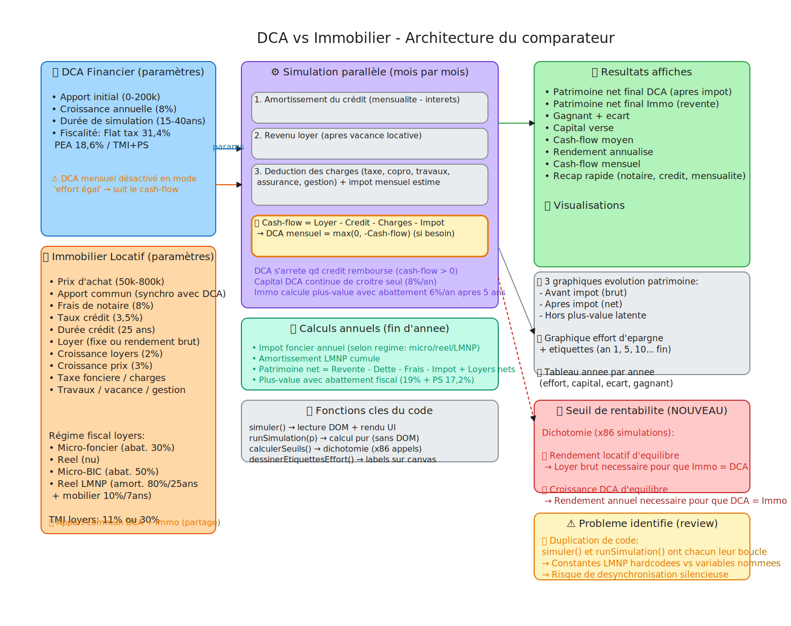

# 📊 DCA vs Immobilier

Comparateur interactif : **investissement financier en DCA** versus **investissement locatif immobilier**.

[➡️ Ouvrir l'outil](https://allardlucas.github.io/dca-vs-immo/) *(aucune installation requise)*

## 📐 Architecture

*[🔗 Ouvrir le diagramme interactif](https://excalidraw.com/#json=EIUrCV7Qj7VyRqk691wfk,8WiZm2bQ2vXWG9NbJNeflg)*

### Vue d'ensemble
- **🟦 Blocs bleus** : paramètres d'entrée (DCA financier + Immobilier)
- **🟪 Blocs violets** : cœur de la simulation (mois par mois)
- **🟩 Blocs verts** : résultats et visualisations
- **🟥 Blocs rouges** : analyse de sensibilité (seuil de rentabilité)
- **🟨 Blocs jaunes** : correctifs et points d'attention

## 🔍 Principe

Chaque mois, le même **effort d'épargne** est investi dans les deux approches :
- **DCA** : le cash-flow négatif de l'immo est placé en bourse (capitalisation mensuelle)
- **Immo** : crédit amortissable, loyers indexés, charges complètes, fiscalité réelle

À la fin de la simulation, on compare le patrimoine net (après impôt) des deux stratégies.

## ⚙️ Paramètres

### DCA Financier
- Apport initial (partagé avec l'immo)
- Croissance annuelle (rendement boursier espéré)
- Durée de simulation
- Fiscalité : Flat tax 31,4% / PEA (PS 18,6%) / TMI + PS

### Immobilier Locatif
- Prix d'achat, apport, frais de notaire (payés sur l'apport)
- Taux et durée du crédit
- Loyer (fixe ou rendement brut), croissance des loyers, croissance du prix
- Taxe foncière, charges copro, travaux, vacance locative, frais de gestion
- **4 régimes fiscaux** : Micro-foncier, Réel (nu), Micro-BIC, **Réel LMNP** (amortissement bâtiment 80%/25 ans + mobilier 10%/7 ans)

## 📈 Résultats

- Patrimoine net final (DCA vs Immo) après impôt
- Rendement annualisé
- Cash-flow mensuel et cash-flow moyen
- **3 graphiques** : Avant impôt, Après impôt, Capital vs Immo hors PV
- **Tableau année par année** : effort annuel, capital investi, valeur nette, écart, gagnant

## 🚀 Utilisation

1. Téléchargez [`index.html`](index.html)
2. Ouvrez-le dans votre navigateur (Chrome, Firefox, Safari, Edge)
3. Ajustez les curseurs — tout se recalcule en temps réel
4. Cliquez sur **📋 Copier le résumé** pour partager les chiffres

**Zéro dépendance** — un seul fichier HTML, CSS et JavaScript vanilla.

## 📝 Notes

- Les frais de notaire sont payés sur l'apport (pas financés par le crédit)
- En LMNP Réel, l'amortissement est une charge comptable (non décaissée) : il réduit l'impôt annuel mais pas le cash-flow mensuel
- La plus-value immobilière bénéficie de l'abattement pour durée de détention (6%/an après 5 ans, max 60%)
- Le DCA cesse après la fin du crédit (le capital continue de croître seul)
